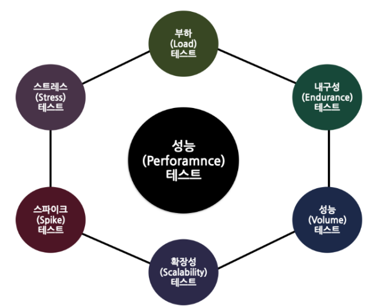

# 성능테스트 종류

* 스트레스(Stress) 테스트

  최대 부하 테스트

* 스파이크(Spike) 테스트

  갑작스러운 부하 증가시 어떻게 반응하고, 정상 수준으로 돌아올 때깢 얼만 걸리는지 확인

* 인더런스(Endurance) 테스트 

  지속적 부하를 가하거나 특정 부하를 유지하는 시나리오를 통해 장기적인 안정성, 메모리 누수, 자원 누수를 검증하는 테스트

* 부하(Load) 테스트

  임계값 한계에 도달할 때까지 시스템의 부하를 지속적으로 꾸준히 증가시켜 시스템의 성능을 테스트

* 성능(Volume) 테스트

  특정 상황에서 시스템의 구성 요소가 어떻게 수행되는지 확인하기 위해 수행되는 테스트

* 확장성(Scalability) 테스트

  응용 프로그램이 증가하는 요구 사항을 견딜 수 있고, 증가된 작업 부하를 수용하도록 효과적으로 확장하며, 다양한 부하에서 응답성과 안정성을 유지할 수 있는지 확인하는 데 사용되는 특수한 형태의 비기능 테스트